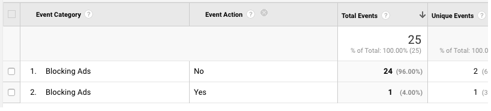

## Welcome to AdBlock Analyzer

Analytics for the ad revenue which is getting blocked by adblocker, integrated with Google Analytics.  

### How to implement AdBlock Analyzer with Google Analytics?

Create a new file `ads.js` in the root directory of the website and paste the below code within it. 
```markdown

var a=document.createElement('div');a.id='adBlockId';a.style.display='none';document.body.appendChild(a);

```


Paste the following code within your website's HTML source code just above the `</body>` tag.
```markdown

<script src="ads.js" type="text/javascript"></script>
<script type="text/javascript">

if(document.getElementById('adBlockId')) {
  adBlockId='false';
} else {
  adBlockId='true';
}
  
if(typeof ga !=='undefined') {
  ga('send','event','Adblock enabled',adBlockId,{'nonInteraction':1});
} else if(typeof _gaq !=='undefined') {
  _gaq.push(['_trackEvent','Adblock enabled',adBlockId,undefined,undefined,true]);
}

</script>

```
### View of Google Analytics report


This report can be found in GA under "Behavior">"Events">"Overview". Here, the unique events data shows the number of sessions(proxy for number of users) where the users had AdBlock enabled or disabled.

### Support or Contact

Having trouble with the script? Create a [new issue](https://github.com/webtaculars/adanalyzer/issues/new) or [connect on Twitter](https://twitter.com/ag251994) and we’ll help you sort it out.
